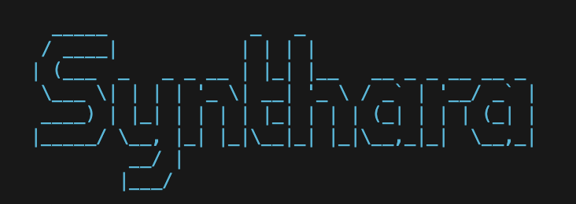

# RAG Transformer: Advanced Retrieval-Augmented Generation System


## Table of Contents

- [Project Overview](#project-overview)
  - [What is RAG Transformer?](#what-is-rag-transformer)
  - [Key Capabilities](#key-capabilities)
  - [How It Works](#how-it-works)
  - [Technical Architecture](#technical-architecture)
  - [Unique Features](#unique-features)
- [Components](#components)
  - [RAG Pipeline](#rag-pipeline)
  - [Knowledge Graph](#knowledge-graph)
  - [Model Integrations](#model-integrations)
- [Prerequisites](#prerequisites)
- [Installation Steps](#installation-steps)
- [Usage](#usage)
  - [Basic RAG Pipeline](#basic-rag-pipeline)
  - [Advanced RAG Pipeline](#advanced-rag-pipeline)
  - [Web Interface](#web-interface)
  - [API Server](#api-server)
  - [Knowledge Graph Visualization](#knowledge-graph-visualization)
  - [Docker Deployment](#docker-deployment)
- [API Documentation](#api-documentation)
- [Troubleshooting](#troubleshooting)
- [Future Improvements](#future-improvements)
- [Code of Conduct](#code-of-conduct)
- [License](#license)

## Project Overview

### What is RAG Transformer?

RAG (Retrieval-Augmented Generation) Transformer is an intelligent AI assistant that combines advanced machine learning techniques to provide contextually rich, informative responses across multiple knowledge domains:

#### Key Capabilities:
- **Intelligent Knowledge Retrieval**: Searches through a diverse dataset of machine learning, science fiction, and cosmic content
- **Context-Aware Responses**: Generates answers that are not just accurate, but contextually relevant
- **Multidomain Intelligence**: Bridges insights from:
  1. Machine Learning Concepts
  2. Science Fiction Movies
  3. Cosmic and Astronomical Observations
- **Advanced Prompting**: Uses few-shot examples and domain-specific templates for better responses
- **Knowledge Graph Visualization**: Creates visual representations of relationships between concepts
- **Web Interface**: User-friendly Streamlit interface with analytics and knowledge base exploration
- **API Server**: FastAPI-based API for integration with other applications
- **Multiple Model Support**: Integrates with Hugging Face, OpenAI, and Anthropic models
- **Deployment Options**: Docker, AWS, and GCP deployment utilities

### How It Works

The system uses a sophisticated multi-step process:
1. **Query Processing**: Parse and analyze the user query
2. **Document Retrieval**: Find relevant documents in the knowledge base
3. **Context Preparation**: Combine retrieved documents into a context
4. **Response Generation**: Generate a response using the context and query
5. **Response Evaluation**: Assess and improve the quality of the response

### Technical Architecture
- **Embedding Model**: `all-MiniLM-L6-v2`
- **Generation Models**: `google/flan-t5-small`, OpenAI GPT, Anthropic Claude
- **Indexing**: FAISS semantic search
- **Data Sources**: TMDB and NASA APIs, Wikipedia, Web content
- **Web Framework**: Streamlit, FastAPI
- **Deployment**: Docker, AWS ECS, Google Cloud Run

### Unique Features
- Interactive query interface
- Knowledge graph visualization
- Performance analytics
- Multi-model support
- Diverse knowledge base
- Real-time response generation
- Cloud deployment options

## Components

### RAG Pipeline
The RAG pipeline consists of the following steps:
1. **Query Processing**: Parse and analyze the user query
2. **Document Retrieval**: Find relevant documents in the knowledge base
3. **Context Preparation**: Combine retrieved documents into a context
4. **Response Generation**: Generate a response using the context and query
5. **Response Evaluation**: Assess and improve the quality of the response

### Knowledge Graph
The knowledge graph visualizes relationships between concepts in the knowledge base:
1. **Entity Extraction**: Identify entities in the documents
2. **Relation Extraction**: Determine relationships between entities
3. **Graph Construction**: Create a graph of entities and relationships
4. **Community Detection**: Identify clusters of related entities
5. **Visualization**: Create a visual representation of the graph

### Model Integrations
The system supports multiple language models:
1. **Hugging Face Models**: Local models for generation
2. **OpenAI Models**: GPT models via API
3. **Anthropic Models**: Claude models via API

## Prerequisites
- Python 3.8+
- Git
- Terminal/Command Line
- Docker (optional, for containerized deployment)

## Installation Steps

### 1. Clone Repository
```bash
git clone https://github.com/synthara-company/rag.git
cd rag
```

### 2. Create Virtual Environment
```bash
python3 -m venv venv
source venv/bin/activate  # On macOS/Linux
# venv\Scripts\activate   # On Windows
```

### 3. Install Dependencies
```bash
pip install -r requirements.txt
```

### 4. Set up API Keys
Create a `.env` file in the project root with the following content:
```
TMDB_API_KEY=your_tmdb_api_key
NASA_API_KEY=your_nasa_api_key
OPENAI_API_KEY=your_openai_api_key  # Optional
ANTHROPIC_API_KEY=your_anthropic_api_key  # Optional
```

### 5. Collect Datasets
```bash
python sci_fi_dataset_collector.py
```

## Usage

### Basic RAG Pipeline
```bash
python rag_pipeline.py
```

### Advanced RAG Pipeline
```bash
python advanced_rag_pipeline.py
```

### Web Interface
```bash
streamlit run advanced_web_interface.py
```

### API Server
```bash
python api_server.py
```

### Knowledge Graph Visualization
```bash
python knowledge_graph_visualizer.py
```

### Docker Deployment
```bash
cd deployment
docker-compose up -d
```

## API Documentation
Once the API server is running, access the API documentation at:
```
http://localhost:8000/docs
```

## Troubleshooting
- Ensure all dependencies are installed
- Check Python version compatibility
- Verify API keys in .env file
- For Docker issues, check Docker logs and ensure ports are available
- For model loading issues, try using a smaller model by modifying the configuration

## Future Improvements
- Integration with more powerful language models
- Enhanced knowledge graph visualization
- Support for multi-modal content (images, audio)
- User authentication and personalization
- Improved performance and scalability

## Code of Conduct

Respect Others: Always treat others with kindness and respect. Do not engage in any form of bullying, harassment, or discrimination.

No Hate Speech: Do not post or share content that is offensive, hateful, or discriminatory towards any individual or group based on race, gender, religion, ethnicity, or sexual orientation.

No Trolling or Spamming: Do not post irrelevant or disruptive content. This includes spamming, posting off-topic content, or engaging in trolling activities that disrupt the community.

No Illegal Activities: Do not share, promote or engage in illegal activities. This includes sharing links to illegal downloads, discussing illegal activities, or selling illicit substances.

Keep It Clean: Do not post or share explicit, adult or overly violent content.

Be Relevant and Constructive: Make sure your posts are relevant to the current topic or thread. Constructive criticism is welcome, but offensive or mean-spirited comments are not.

Use Appropriate Language: Avoid swearing, offensive language, or sexually explicit language.

No Sharing Personal Information: Do not share your own or other members' personal information, such as addresses, phone numbers, or other confidential information.

Respect Intellectual Property: Do not post anything that infringes on anyone's intellectual property rights. Always credit the original source of the content.

No Promotion or Advertising: Do not advertise or promote commercial products or services without permission from the moderators.

Follow the Moderators: Listen to and respect decisions made by the moderators. They have the right to warn, kick, or ban users who violate the rules.

No Duplicate Accounts: Each user is allowed only one account.

## License
This project is licensed under the MIT License - see the [LICENSE](LICENSE) file for details.